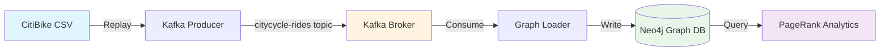

# CityCycle: Real-Time Urban Mobility Graph Analytics


**CityCycle** is a real-time data engineering platform that ingests bike-share trip data, builds a dynamic city mobility graph, and performs network analytics to identify critical transportation hubs.

## 🏗️ Architecture

The platform implements a modern streaming data pipeline:



### Data Flow
1. **Ingestion**: `replay_rides.py` simulates real-time bike trips by streaming CSV data to Kafka
2. **Buffering**: Kafka decouples data production from consumption
3. **Storage**: `graph_loader.py` consumes messages and builds a Neo4j graph
4. **Analytics**: `graph_algo.py` runs PageRank to identify hub stations

## 🚀 Tech Stack

| Component | Technology | Purpose |
|-----------|-----------|---------|
| **Streaming** | Apache Kafka | Message buffering and event streaming |
| **Database** | Neo4j (with GDS) | Graph storage and analytics |
| **Language** | Python 3.10+ | Data processing and orchestration |
| **Infrastructure** | Docker Compose | Local development environment |

## 📋 Prerequisites

- **Docker** & **Docker Compose**
- **Python 3.10+**
- **pip** (Python package manager)

## 🔧 Setup

### 1. Clone the Repository
```bash
git clone https://github.com/spacelord16/CityCycle.git
cd CityCycle
```

### 2. Install Python Dependencies
```bash
pip install -r requirements.txt
```

### 3. Start Infrastructure
```bash
cd infrastructure
docker-compose up -d
```

This spins up:
- **Zookeeper** (port 2181)
- **Kafka** (port 9092)
- **Neo4j** (ports 7474, 7687)

Verify Neo4j is running: [http://localhost:7474](http://localhost:7474)
- Username: `neo4j`
- Password: `citycycle`

### 4. Generate Sample Data
```bash
python3 src/utils/generate_data.py
```

Creates `data/rides.csv` with 1000 synthetic bike trips.

## 🎯 Usage

### Step 1: Produce Data to Kafka
Open a terminal and run:
```bash
cd src/producer
python3 replay_rides.py
```

This streams ride events to the `citycycle-rides` Kafka topic.

### Step 2: Consume and Load into Neo4j
Open a **second terminal** and run:
```bash
cd src/consumer
python3 graph_loader.py
```

This consumes Kafka messages and creates:
- **Nodes**: `(:Station {id, name, lat, lng})`
- **Relationships**: `(:Station)-[:RIDE {ride_id, started_at, ended_at}]->(:Station)`

### Step 3: Run Analytics
After loading data, run PageRank to find hub stations:
```bash
cd src/analytics
python3 graph_algo.py
```

**Example Output:**
```
Graph Stats: {'station_count': 6, 'ride_count': 1000}
Top 10 Hub Stations:
1. W 42 St & 8 Ave (Score: 2.4532)
2. Central Park West & W 72 St (Score: 1.8921)
3. E 42 St & 2 Ave (Score: 1.7654)
...
```

## 📊 Sample Queries

Open Neo4j Browser ([http://localhost:7474](http://localhost:7474)) and try:

### Find all rides from a station
```cypher
MATCH (start:Station {name: "Central Park West & W 72 St"})-[r:RIDE]->(end)
RETURN start.name, end.name, r.started_at
LIMIT 10
```

### Count rides per station
```cypher
MATCH (s:Station)-[r:RIDE]->()
RETURN s.name, count(r) AS ride_count
ORDER BY ride_count DESC
```

## 🧪 Project Structure

```
city-cycle-graph/
├── infrastructure/
│   └── docker-compose.yaml    # Kafka + Neo4j stack
├── src/
│   ├── producer/
│   │   └── replay_rides.py    # Kafka producer
│   ├── consumer/
│   │   └── graph_loader.py    # Neo4j loader
│   ├── analytics/
│   │   └── graph_algo.py      # PageRank implementation
│   └── utils/
│       └── generate_data.py   # Synthetic data generator
├── data/                      # CSV files (gitignored)
├── requirements.txt
└── README.md
```

## 🎓 What This Demonstrates

For portfolio/interview purposes, this project showcases:

1. **Stream Processing**: Kafka-based event-driven architecture
2. **Graph Databases**: Neo4j schema design and Cypher queries
3. **Distributed Systems**: Decoupled producer-consumer pattern
4. **Data Pipelines**: End-to-end ETL (Extract, Transform, Load)
5. **Network Analysis**: Graph algorithms (PageRank via Neo4j GDS)
6. **Infrastructure as Code**: Docker Compose orchestration

## 🛠️ Future Enhancements

- [ ] Add Kafka Connect for zero-code integration
- [ ] Implement Community Detection algorithm
- [ ] Build a visualization dashboard (D3.js or Streamlit)
- [ ] Deploy to Kubernetes
- [ ] Add monitoring (Prometheus/Grafana)

## 📝 License

MIT License - feel free to use this for your own portfolio!

## 🤝 Contributing

This is a portfolio project, but suggestions are welcome! Open an issue or PR.
